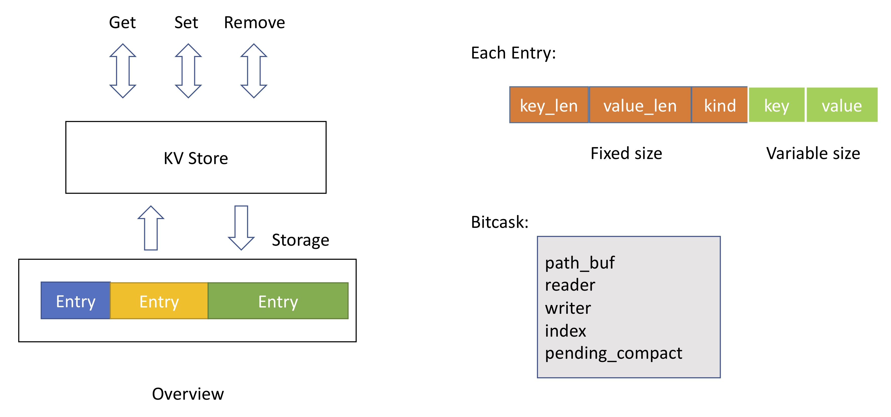

# A mini kv database demo that using simplified Bitcask 


## Introduction

> From the book _Designing Data-Intensive Applications_ by **Martin Kleppmann**

Key-value stores are similar to a hash map (hash table) in most programming languages. Let's say our data storage consists only of appending to a file. Then the simplest indexing strategy is: keep an in-memory hash map where every key is mapped to a byte offset in the data file - the location at which the value can be found, as illustrated:


Whenever you append a new key-value pair to the file, you also update the hash map to reflect the offset of the data you just wrote (this works both for inserting new keys and for updating existing keys). When you want to look up a value, use the hash map to find the offset in the data file, seek to that location, and read the value. In fact, this is essentially what `Bitcask` does. The values can be loaded from disk with just one disk seek. 

A storage engine like `Bitcask` is well suited to situations where the value for each key is updated frequently. For example, the key might be the URL of a cat video, and the value might be the number of times it has been played (incremented every time someone hits the play button). In this kind of workload, there are a lot of writes, but there are not too many distinct keys - you have a large number of writes per key, but it's feasible to keep all keys in memory. 

From the above key-value stores, there are two main tasks we need to solve:

- The In-memory hash map contains `key` and `byte offset`, how to write/read the key-value pairs into the log-structured file on the disk. We need to encode/decode the data.
- How do we avoid eventually running out of disk space? We need to perform _compaction_ to throw away duplicate keys in the log, and keeping only the most recent update for each key.

More details: [Bitcask: A Log-Structured Hash Table for Fast Key/Value Data](resources/bitcask-intro.pdf)


## Overview



This storage engine supports three basic operations: `Get`, `Set`, and `Remove`. The `KV Store` is used to communicate with the client, receive the user's commands and return the results. `Storage` is used to store the encoded data after persistence. Each `Entry` includes one pair of key and value. After encoding, The size of each entry is different.

The basic read/write/compact process:

- Initialization: read data from disk and generate the index (`HashMap`)

> Read

- Receive the `Get` command, find the `offset` in the disk through the index
- Then `read_at` the above `offset` to obtain the data, decode to key and value, return

> Write

- Encapsulate the key and value into the `Entry`, insert into the index (`key` and `offset`), encode the entry and store in the disk.
- If it reaches `COMPACTION_THRESHOLD`, we need to perform the compaction operation.

> Compact

- Remove the invalid entries, keep valid ones and store them in a new file
- One simple way: loop all entries in order, save valid ones in a `Vec`, write them in a new file and replace the old one.

## Encode/Decode data

The key point is to know the start and end locations of each `Entry`, we can get the start location (`offset`) from the index (`HashMap`: `key` and `offset`). The question is that we need to know the end location or entry size (end - start). Here, we solve this problem by using `Fixed` + `Variable` design.

The user can enter key and value of any length, but we can use the `fixed` length bytes to describle the lengths of key and value. Say, 4 bytes (usize) can represent the length of key and value between 0 and 2^32. We also need the `kind` field to describle whether the entry valid or not. The `key len`, `value len` and `kind` form the fixed-length part, which is considered as the header.

Once we get the `offset` through the index, we can directly obtain the header information because they are fixed. Then we get the lengths of key and value. Throught the start location and length, we can correctly decode the entire entry.

## Dependencies

```
bincode = "1.3"
clap = { version = "3.1", features = ["derive"] }
thiserror = "1.0"
serde = { version = "1.0.137", features = ["derive"] }
serde_repr = "0.1.8"
```

## Commands 

```
kvs 0.1.0

USAGE:
    kvs <SUBCOMMAND>

OPTIONS:
    -h, --help       Print help information
    -V, --version    Print version information

SUBCOMMANDS:
    get     get <KEY>
    help    Print this message or the help of the given subcommand(s)
    rm      rm <KEY>
    set     set <KEY> <VALUE>
```


## Reference

- <https://github.com/Morgan279/miniDB>